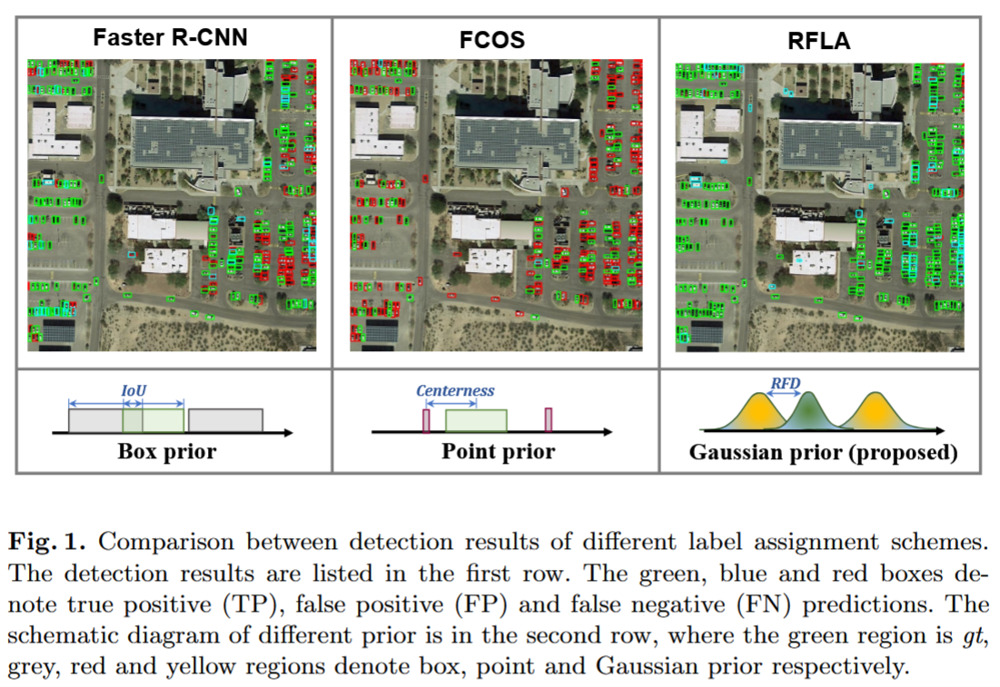

# Computer Vision Papers

## DINO [https://arxiv.org/pdf/2104.14294] ✅📜
* DINO: self-**di**stillation with **no** labels
* Facebook trained a vision transformer backbone with self supervised learning
  * Unsupervised learning is about learning patterns in the data without any labels or supervision. Example: clustering
  * Self supervised learning is a form of supervised learning where the labels are generated from the data itself (i.e no human labelling needed). To do this you have to define a "pre-text task"
  * DINO's "pre-text task" is learning to map global image representations (from the teacher) to the local representations of the student. In this way 
* _"In this paper, we question whether the muted success of
Transformers in vision can be explained by the use of super-
vision in their pretraining. Our motivation is that one of the
main ingredients for the success of Transformers in NLP was
the use of self-supervised pretraining"_
* _"self-supervised pretraining objectives use the words
in a sentence to create pretext tasks that provide a richer
learning signal than the supervised objective of predicting
a single label per sentence. Similarly, in images, image-
level supervision often reduces the rich visual information
contained in an image to a single concept selected from a
predefined set of a few thousand categories of objects"_
* _"knowledge distillation ... (is the process of) training a small network to mimic the
output of a larger network to compress it"_
* _"Our work extends knowledge distillation to the case
where no labels are available."_
* Usually, knowledge distillation means one pretrained (or labeled) model (teacher) teaches another model (student); 
* It's expensive to directly train a teacher model when labels aren't available
* DINO instead applies knowledge distillation without labels, training teacher and student simultaneously.
* In DINO, the "teacher" is updated by averaging the student's weights over time.
* _" the teacher in
codistillation is distilling from the student, while it is
updated with an average of the student in our work."_
* Averaging the student's weights to form the teacher creates a stable, low-noise reference, that acts as a "memory", storing consistent patterns
### Normal Knowledge Distillation Paradigm
* Train student network $$g_{θ_{s}}$$ to match teacher output $$g_{θ_{t}}$$. They both model probability distributions $$p_{s}(x)$$ and $$p_{t}(x)$$: 
* I.e minimise cross entropy of
```math
\text{min} (\theta_{s})[-p_{t}(x) \text{log}(p_{s}(x))]
```
### DINO Paradigm
* For every image in the dataset, generate a set $V$ of augmentations. 
* This set contains two full size augmentations $x_{1}^{g},x_{2}^{g}$ and several smaller (cropped) image augmentations
* All augmentation are passed to the student, only global ones are passed to the teacher
* This encourages the student to learn to recognize global patterns from smaller crops. I.e the student gains stronger feature representations because it must generalise from the particular.
* The loss function is then
```math
\min_{\theta_s} \sum_{x \in \{x_1^g, x_2^g\}} \sum_{x' \in V, x' \neq x} H(P_t(x), P_s(x'))
```
* Both networks share the same architecture g with different sets of parameters
* The teachers weights are a exponential moving average of the student's weights
* The architecture is a backbone (resnet or vit) with a projection head (fully connected 3 layer MLP)
#### Avoiding model collapse
* Model collapse is when the network learns to just output a shortcut or hack instead of learning features that will generalise
* DINO avoids this by sharpening and centering the output distribution
* Sharpening avoids uniform distribution collapse, centering avoids single dimension collapse
#### Summing it all up
* The teacher network sees only global crops, creating stable, high-level semantic embeddings. The student network sees local and global crops and learns to predict the teacher's global-level embeddings from local crops, forming a supervised task ("local views must match global views") without external labels. Thus this is a form of self supervised learning, and it produces features that are superior at generalising. The point of this paper is to show that big vision networks trained with a self supervised strategy learn superior features to supervised vision networks, just like self supervised learning in language processing (i.e LLMS) produces stronger models than the supervised case.

## YOLOX [https://arxiv.org/pdf/2107.08430] ✅📜
* Increase YOLO performance through some different techniques
* Take Yolov3 with Darknet-53 backbone, make changes
### Anchor-free detection
* Previous YOLO uses anchor boxes. These are basically "templates" for different box shapes / sizes.
* This has a few problems.
* Firstly, you need to do cluster analysis on your dataset which doesn't work for transfer learning.
* Secondly, it increases the complexity of the detection heads, and number of predictions, which makes it slow. 
* YoloX does 1 anchor free prediction per grid instead of 3, based on the object centerpoint.
* This should mean is better at unusual (size) / (shape) objects
### Decoupled head 
* There's a trade off between classification and localization. The features learned for each task are at odds with the other task.
* So you split the head to avoid this in two, do one for each task, and it performs better
### SimOTA
* Label assignment is about matching lables with predictions so you can compute loss
* YoloX uses an advanced label assignment strategy (SimOTA)
* Formulates the assigning procedure as an optimal transport problem (OT problem) 
* Optimal transport is a general mathmatical category of the problem of transporting mass while minimising cost. Can formulate label assignment as this
* SimOTA takes into account four key principles. 
 * 1. Loss aware: SimOTA prioritises better quality predictions (compared to GT) through matching degree
 * Matching degree can be formalised as
```math
c_{i,j} = L_{i,j}^{classification} + \lambda L_{i,j}^{regression}
```
 * 2. Center prior: prioritise objects close to center of GT
 * 3. Dynamically select the number of predictions for each GT (top-k)
 * 4. Globally optimise assignment, not just locally
### NMS free (end to end) detector
* They experiment with adding two addidtional conv layers to perform end to end (no nms) but it slightly decreases performance and inference speed and leave it out

## RFLA: Gaussian Receptive based Label Assignment for Tiny Object Detection [https://arxiv.org/abs/2208.08738] 📜
* Object detectors are very bad on tiny objects (defined as < 16x16 pixels)
* This is true for both anchor based detectors (which use box priors) and anchor free detectors (which use point priors)
* Both of these approaches misclassify tiny objects as outliers
* The paper reframes it in terms of prior distributions for both box and point prior detectors
```math
p(v|x,y) = \frac{\epsilon(x-x1)\epsilon(x2-x)\epsilon(y-y1)\epsilon(y2-y)}{(x2 - x1)(y2 - y1)}
```
Epsilon just tells us its 1 if the term is positive and 0 otherwise. So we can write it as a piecewise probability distribution
```math
p(v \mid x, y) =
\begin{cases}
\frac{1}{(x_2 - x_1)(y_2 - y_1)}, & \text{if } x_1 \le x \le x_2 \text{ and } y_1 \le y \le y_2, \\
0, & \text{otherwise.}
\end{cases}
```
I.e it is a uniform distribution.
* For anchor box detectors the denominator (normalizer) is the area of the box
```math
p(v \mid x, y) =
\begin{cases}
\frac{1}{w*h}, & \text{if } x_1 \le x \le x_2 \text{ and } y_1 \le y \le y_2, \\
0, & \text{otherwise.}
\end{cases}
```
* For anchor free (point) detectors the denominator is 1 as the area is a single point
```math
p(v \mid x, y) =
\begin{cases}
1, & \text{if } x_1 \le x \le x_2 \text{ and } y_1 \le y \le y_2, \\
0, & \text{otherwise.}
\end{cases}
```

* A big problem is that label assignment metrics depend on there being overlap between the non zero part of the distribution and the ground truth location
* I.e IOU for anchor boxes - there is often no IOU
* And for centernees, there is often no anchor points inside the tiny object
* Therefore, the network pretrained on for example COCO, will not learn circuits for tiny objects, it's not getting a good training signal.
* Therefore, they introduce not a box or point based uniform distribution prior, but a gaussian one. 
* This comes from the fact that the effective receptive field of CNNs is gaussian distributed
* As the probability is nonzero at every point this fixes the "no overlap" problem
* "Combining the Gaussian receptive field and
its customized label assignment strategy can significantly alleviate the imbalance
problem raised by existing prior and measurement for tiny objects."
* "The multi-resolution image pyramid is a basic way of
multi-scale learning."
* "One basic principle that mainstream object detectors obey is dividing and con-
quering, namely detecting objects of different scales on the different layers of
FPN"

## FCOS: A simple and strong anchor-free object detector [https://arxiv.org/abs/2006.09214] 📜

## Fast R-CNN [https://arxiv.org/abs/1504.08083] 📜

## DetectoRS: Detecting Objects with Recursive Feature Pyramid and Switchable Atrous Convolution [https://arxiv.org/abs/2006.02334] 📜
